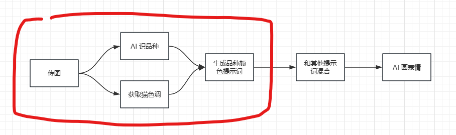
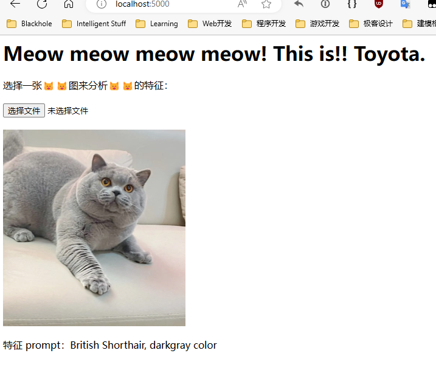
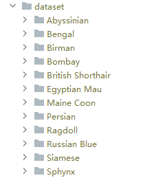

# 😻😻🐻

本目录内是一个用于识别猫猫品种和颜色的程序，上传一张猫猫图，就可以得到猫猫的品种和颜色的 prompt，用于辅助后续图片生成.

程序完成了😻😻🐻业务逻辑的红框部分：



本文档就本程序进行说明.

## 效果预览



## 整体使用流程

1. 启动程序.
2. 打开😻😻图片上传网页.
3. 上传图片并等待结果.

## 启动项目

### 1. 设置环境

本项目需要一个 PyTorch 环境，可以使用 Conda 或本机原生环境安装.

PyTorch 环境安装参考：https://pytorch.org/get-started/locally/

安装好 PyTorch 后，使用 `pip` 安装项目下的 `requirements.txt`: 

```bash
pip install -r requirements.txt
```

完成后依赖安装完毕.

### 2. 启动网页

在项目目录下，使用 Python 启动 `web.py` 文件:

```bash
python ./web.py
```

### 3. 使用

执行命令后，程序将启动一个本地网页服务器，地址为 [http://localhost:3000](http://localhost:3000)，直接打开即可上传😻😻图.

## 技术细节

本模型基于 `Resnet18` 训练而成，目前可以识别 12 个品种的😻😻，由于训练集图片主要是成😻，所以对于幼😻的识别率较差.

Resnet18 的效果实际看来还可以，没有继续使用更多层数，层数过多反而会引入其他噪声；模型使用了随机梯度下降优化器，没有使用动态学习率、Dropout 等其他手段，实际看来效果尚可，因此没有继续增加项目复杂度.

颜色获取功能使用了工程方式解决，大部分😻😻图片的图片主体都是😻，所以只需要提取图片的主体色彩即可，然后将颜色数值 (0xff0000) 转换为颜色名称 (Red).

## 如何训练

项目中包含了训练和测试代码，可以根据自己的需求重新训练.

### 1. 准备训练集

训练集图片在 `dataset/` 目录中，目录中包含了多个子文件夹，每个文件夹都对应一个猫品种，文件夹名称就是猫品种名称：



按照此格式准备数据图片即可.

### 2. 启动训练

启动目录下的 `train.py` 脚本即可开始训练，训练过程中的权重文件将保存为 `model.pth`，每完成一次 epoch 权重将自动进行保存.

## 测试脚本

将需要测试的😻😻图片放置在 `test/` 目录下，执行 `test.py` 即可进行测试，结果将通过控制台进行输出.
